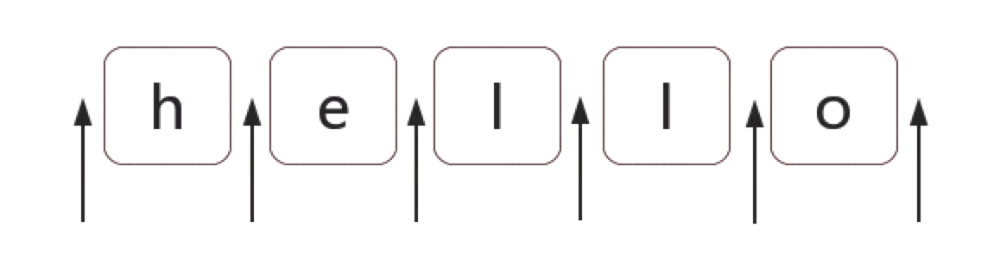

# Javascript正则表达式

## 正则表达式

一种几乎可以再所有的程序设计语言和所有的计算机平台上使用的文字处理工具。可以用来查找特定的信息（搜索），也可以用来查找并编辑特定的信息（替换）。

### 语法

#### 基本元字符

1. `.`：匹配除了换行符之外的任何单字符
2. `\`：在非特殊字符之前的反斜杠表示下一个字符是特殊的，不能从字面上解释。例如，没有前`\`的`b`通常匹配为小写b。反斜杠也可以将其后面的特殊字符，转义为字面量。例如，`/a*/`代表会比配0个或者多个a，加入`\`之后，`/a\*/`将`*`的特殊性移除，从而可以匹配像`a*`这样的字符串。
3. `|`：逻辑或操作符
4. `[]`：定义一个字符集合，匹配字符集合中的一个字符，在字符集合里面像`.`、`\`这些字符都表示其本身。
5. `[^]`：对上面一个集合取非
6. `-`：定义一个区间，例如`[A-Z]`，其首尾字符在 ASCII 字符集里面

#### 数字元字符

1. `{m,n}`：匹配前面一个字符至少m次至多n次重复，还有`{m}`表示匹配m次，`{m,}`表示至少m次。
2. `+`：匹配前面一个表达式一次或者多次，相当于`{1,}`。记忆方式追加(+)，起码一次。
3. `*`：匹配前面一个表达式零次或者多次，相当于`{0,}`。记忆方式乘法(*)，起码零次。
4. `?`：单独使用匹配前面一个表达式零次或者一次。相当于`{0,1}`，有就匹配一次。如果跟在任何量词`+`、`*`、`?`、`{}`后面的时候将会使量词变为非贪婪模式（尽量匹配少的字符），默认是贪婪模式。比如对`123abc`应用`/\d+/`将会返回`123`，如果使用`/\d+?/`，那么只会匹配到`1`。

#### 位置元字符

1. `^`：单独使用匹配表达式的开始
2. `$`：匹配表达式的结束
3. `\b`：匹配单词边界
4. `\B`：匹配非单词边界
5. `(?=p)`：匹配字符 `p` 之前的那一个位置
6. `(?!p)`：匹配除去 `p` 之前那一个位置的其他所有位置

#### 特殊元字符

1. `\d`：`[0-9]`，表示一位数字
2. `\D`：`[^0-9]`，表示一位非数字
3. `\s`：`[\t\v\n\r\f]`，表示空白符，包括空格，水平制表符（`\t`），垂直制表符（`\v`），换行符（`\n`），回车符（`\r`），换页符（`\f`）
4. `\S`：`[^\t\v\n\r\f]`，表示非空白符
5. `\w`：`[0-9a-zA-Z_]`，表示字母数字和下划线
6. `\W`：`[^0-9a-zA-Z_]`，表示非字母数字和下划线

#### 标志字符

1. `g`：全局搜索
2. `i`：不区分大小写
3. `m`：多行搜索

### RegExp类型

ECMAScript通过RegExp类型来支持正则表达式。使用下面类似Perl的语法，就可以创建一个正则表达式。

```perl
var expression = / pattern / flags
```

其中模式`pattern`部分可以是任何简单或复杂的正则表达式，可以包括字符类、限定符、分组、向前查找以及反向引用。

每个正则表达式都可以带一个或多个标志`flags`，用以标明正则表达式的行为。标志即上面提到的标志字符`g`、`i`、`m`三种类别。

#### 支持正则的String对象的方法

1. `String.prototype.search`

接受一个正则作为参数，如果传入参数不是正则则会隐式的使用 `new RegExp(obj)` 将其转换为一个正则，返回匹配到子字符串的起始位置，匹配不到返回-1。

2. `String.prototype.match`

接受参数和上面的方法一致。返回值依赖传入的正则是否包含 `g` ，如果没有 `g` 标识，那么 `match` 方法对 `string` 做一次匹配，如果没有找到任何匹配的文本时，`match` 会返回 `null` ，否则，则会返回一个数组。数组首个元素包含匹配到的文本，其余元素放的是正则捕获的文本，数组还包括两个属性，`index` 表示匹配文本在字符串中的位置，`input` 表示被解析的原始字符串。如果有 `g` 标识，则返回一个数组，包含每一次的匹配结果。

```javascript
var str = 'For more information, see Chapter 3.4.5.1';
var re = /see (chapter \d+(\.\d)*)/i;
var found = str.match(re);
console.log(found);
// (3) ["see Chapter 3.4.5.1", "Chapter 3.4.5.1", ".1", index: 	22, input: "For more information, see Chapter 3.4.5.1"]
// 0:"see Chapter 3.4.5.1"
// 1:"Chapter 3.4.5.1"
// 2:".1"
// index:22
// input:"For more information, see Chapter 3.4.5.1"
// length:3
// __proto__:Array(0)

// 'see Chapter 3.4.5.1' 是整个匹配。
// 'Chapter 3.4.5.1' 被'(chapter \d+(\.\d)*)'捕获。
// '.1' 是被'(\.\d)'捕获的最后一个值。
// 'index' 属性(22) 是整个匹配从零开始的索引。
// 'input' 属性是被解析的原始字符串。

var str = 'ABCDEFGHIJKLMNOPQRSTUVWXYZabcdefghijklmnopqrstuvwxyz';
var regexp = /[A-E]/gi;
var matches_array = str.match(regexp);

console.log(matches_array);
// ['A', 'B', 'C', 'D', 'E', 'a', 'b', 'c', 'd', 'e']
```

3. `String.prototype.replace`

接受两个参数，第一个是要被替换的文本，可以是正则也可以是字符串。如果是字符串的时候不会被转换为正则，而是作为检索的直接量文本。第二个是替换成的文本，可以是字符串或者函数，字符串可以使用一些特殊的变量来替换前面捕获到的子串。

变量名 | 代表的值
:--: | :--:
$$ | 插入一个“$”
$& | 插入匹配的字符串
$` | 插入当前匹配的子串左边的内容
$' | 插入当前匹配的子串右边的内容
$n | 加入第一个参数是RegExp对象，并且 n 是个小于100的非负整数，那么插入第 n 个括号匹配的字符串

```javascript
var re = /(\w+)\s(\w+)/;
var str = "John Smith";
var newstr = str.replace(re, "$2, $1");
// Smith, John
console.log(newstr);
```

如果第二个参数是函数的话，函数传入参数如下，返回替换成的文本

变量名 | 代表的值
:--: | :--:
match | 匹配的字符串（对应上表中的$&）
p1,p2,... | 若replace()方法第一个参数是RegExp对象，则代表第n个括号匹配的字符串（对应上表中的$1,$2）
string | 被匹配的原字符串

```javascript
function replacer(match, p1, p2, p3, offset, string) {
  // p1 is nondigits, p2 digits, and p3 non-alphanumerics
  return [p1, p2, p3].join(' - ');
}
var newString = 'abc12345#$*%'.replace(/([^\d]*)(\d*)([^\w]*)/, replacer);
// newString   abc - 12345 - #$*%
```

4. `String.prototype.split`

接受两个参数，返回一个数组。第一个是用来分割字符串的字符或者正则，如果是空字符则会将原字符串中的每个字符以数组的形式返回，第二个参数可选作为限制分割多少个字符，也是返回的数组的长度限制。需要注意的是，用捕获括号的时候会将匹配结果也包含在返回的数组中。

```javascript
var myString = "Hello 1 word. Sentence number 2.";
var splits = myString.split(/\d/);

console.log(splits);
// [ "Hello ", " word. Sentence number ", "." ]

splits = myString.split(/(\d)/);
console.log(splits);
// [ "Hello ", "1", " word. Sentence number ", "2", "." ]
```

#### RegExp实例属性

RegExp的每个实例都具有下列属性，通过这些属性可以取得有关模式的各种信息。

* **global**： 布尔值，表示是否设置了 `g` 标志
* **ignoreCase**：布尔值，表示是否设置了 `i` 标志
* **lastIndex**：整数，表示开始搜索下一个匹配项的字符位置，从0算起
* **multiline**：布尔值，表示是否设置了 `m` 标志
* **source**： 正则表达式的字符串表示，按字面量形式而非传入构造函数中的字符串模式返回

#### RegExp实例方法

1. `test`

接受一个字符串参数，如果正则表达式与指定的字符串匹配则返回 `true`，否则返回 `false` 。

2. `exec`

接受一个字符串参数，返回一个数组，其中存放匹配的结果，如果未找到匹配，则返回 `null` 。

匹配时，返回值与 `match` 方法没有 `g` 标识时是一样的。数组首个元素表示与正则匹配的文本，后面 n 个是对应的 n 个捕获的文本，最后两个是 `index` 和 `input`。

对于 `exec` 来说，即使设置了全局标志（g），它每次也只会返回一个匹配项。

在不设置全局标志的情况下，在同一个字符串上多次调用 `exec` 将始终返回第一个匹配项的信息。

而在设置全局标志的情况下，每次调用 `exec` 都会更新正则实例的 `lastIndex` 属性，会在字符串中继续查找新匹配项。因此经常需要配合 `while` 循环使用。

```javascript
var text = "cat, bat, sat, fat";
var pattern1 = /.at/;

var matches = pattern1.exec(text);
console.log(matches.index); // 0
console.log(matches[0]); // cat
console.log(pattern1.lastIndex); // 0

matches = pattern1.exec(text);
console.log(matches.index); // 0
console.log(matches[0]); // cat
console.log(pattern1.lastIndex); // 0

var pattern2 = /.at/;

var matches = pattern2.exec(text);
console.log(matches.index); // 0
console.log(matches[0]); // cat
console.log(pattern1.lastIndex); // 3

matches = pattern2.exec(text);
console.log(matches.index); // 5
console.log(matches[0]); // bat
console.log(pattern1.lastIndex); // 8

var string = "2017.06.27";
var pattern3 = /\b(\d+)\b/g;
var result;
while(result = pattern3.exec(string)){
  console.log(result, pattern3.lastIndex)
}
// ["2017", "2017", index: 0, input: "2017.06.27"]
// ["06", "06", index: 5, input: "2017.06.27"]
// ["27", "27", index: 8, input: "2017.06.27"]
```

#### RegExp 构造函数属性

RegExp 构造函数包含一些属性，这些属性适用于作用域中的所有正则表达式，并且基于所执行的最近一次正则表达式操作而变化。关于这些属性的另一个独特之处，就是可以通过两种方式访问它们。

长属性名 | 短属性名 | 说明
:--: | :--: | :--:
input | $_ | 最近一次要匹配的字符串
lastMatch | $& | 最近一次的匹配项
lastParen | $+ | 最近一次匹配的捕获组
leftContext | $` | input 字符串中 lastMatch 之前的文本
multiline | $* | 布尔值，表示是否所有表达式都使用多行模式
rightContext | $' | input字符串中 lastMatch 之后的文本

除了上面几种属性，还有9个用于存储捕获组的构造函数属性，分别是 `$1-$9` 。

### 正则的匹配

#### 字符匹配

精确匹配，比如 `/hello/` ，也只能匹配字符串中的"hello"这个子串。正则表达式之所以强大，是因为其能实现模糊匹配。

#### 匹配多种数量

用 `{m,n}` 来匹配多种数量，其他几种形式（`+*?`）也可以等价为这种。

```javascript
var regex = /ab{2,5}c/g;
var string = "abc abbc abbbc abbbbc abbbbbc abbbbbbc";
console.log(string.match(regex)); // ["abbc", "abbbc", "abbbbc", "abbbbbc"]
```

**贪婪模式和非贪婪模式**：默认是贪婪模式

```javascript
var regex = /\d{2,5}/g;
var string = "123 1234 12345 123456";
console.log(string.match(regex)); // ["123", "1234", "12345", "12345"]
```

重复次数后面加上 `?` 就可以表示非贪婪(尽可能匹配少的字符)

```javascript
var regex = /\d{2,5}?/g;
var string = "123 1234 12345 123456";
console.log(string.match(regex)); // ["12", "12", "34", "12", "34", "12", "34", "56"]
```

#### 匹配多种情况

用字符组 `[]` 来匹配多种情况，其他几种形式（`\d\D\s\S\w\W`）都可以等价为这种。

```javascript
var regex = /a[123]b/g;
var string = "a0b a1b a2b a3b a4b";
console.log(string.match(regex)); // ["a1b", "a2b", "a3b"]
```

如果字符组里面字符特别多的话可以用 `-` 来表示范围，比如 `[123456abcdefGHIJKLM]`，可以写成 `[1-6a-fG-M]`。多种情况下还可以使用分支，用管道符 `|` 来连接。

```javascript
var regex = \good|goodbye\g;
var string = "goodbye";
console.log(string.match(regex)); // ["good"]
```

从上面例子也可以看出分支结构是惰性的，匹配到了以后就不再往后尝试了。

**例子**：掌握以上两种方式就可以解决比较常见的一些简单正则问题了。

1. 最多保留2位小数的数字：`/^([1-9]\d*|0)(\.\d{1,2})?$/`
2. 电话号码：`/(\+86)?1\d{10}/`
3. 身份证：`/^(\d{15}|\d{17}([xX]|\d))$/`

#### 位置匹配

##### 什么是位置

位置是相邻字符之间的，比如，有一个字符串 `hello`，这个字符串一共有6个位置 `*h*e*l*l*o*`，这里 `*` 代表位置。



上面介绍元字符时说到了6种位置元字符

1. `^`、`$`匹配字符的开头和结尾。`/^hello$/`匹配一个字符串，字符开头位置之后紧接着 h ，字符结尾之前紧接着 o 。位置还可以被匹配并替换，比如 `'hello'.replace(/^|$/g, '#')`，执行结果为 `#hello#` 。

2. `/b`、`/B` 匹配单词边界和非单词边界。单词边界具体指 `\w`（`[a-zA-Z0-9_]`）和 `\W`之间的位置，包括 `\w` 和 `^` 以及 `$` 之间的位置。比如 `'hello world [js]_reg.exp-01'.replace(/\b/g, '#')` 的结果是 `'#hello# #world# [#js#]#_reg#.#exp#-#01#'` 。非单词边界指的就是除单词边界之外的边界，包括 `\w` 与 `\w` 之间和 `\W` 与 `\W`之间。

3. `(?=p)`、`(?!p)`匹配字符 `p` 之前的那个位置和除之前那个位置之外的其余位置。比如 `'hello'.replace(/(?=e)/g, '#')` 结果是 `h#ello`， `'hello'.replace(/(?<e)/g, '#')` 结果是 `#he#l#l#o#`。其实这种写法叫零宽断言，对应的还有负向零宽断言，不仅仅是匹配位置，还可以匹配我们需要的文本。下面详细介绍这一块。

##### 位置的特性

字符与字符之间的位置可以是多个。在理解上可以将位置理解为空字符串，比如 `hello` 可以是一般的 `'' + 'h' + 'e' + 'l' + 'l' + 'o' + ''`，也可以是 `'' + '' + '' + 'h' + 'e' + 'l' + 'l' + 'o' + '' + ''`。

**例子**：千分位，将123123123转换为123,123,123。

数字是从后往前数，也就是以一个或者多个3位数字之前的位置换成','就好了。写成正则就是 `'123123123'.replace(/(?=(\d{3})+$)/g, ',')`，但是这样会在最前面也加上一个','，要求匹配到的位置不是开头，正则改进之后为 `/(?!^)(?=(\d{3})+$)/g`。

但是这里如果改成以数字开头来要求的话，得出正则 `/\d(?=(\d{3})+$)/g`，这里得到结果是 `12,12,123`。因此，如果要求一个正则是匹配位置的话，那么所有的条件都必须是位置。

#### 分组

分组主要是括号的使用

##### 分组和分支结构

在分支结构中，括号是用来表示一个整体的

```javascript
'I love JavaScript'.match(/^I love (JavaScript|Regular Expression)$/)
// ['I love JavaScript', 'JavaScript', index:0, input: 'I love JavaScript']
```

##### 引用分组

###### 提取数据

比如我们要用正则匹配一个日期格式， yyyy-mm-dd，可以写出简单的正则 `/\d{4}-\d{2}-\d{2}/`，这个正则改成分组的形式是 `/(\d{4})-(\d{2})-(\d{2})/`，这样我们可以提取出一个日期的年月日，用 String 的 match 方法或者使用正则的 exec 方法都可以。

```javascript
var regex = /(\d{4})-(\d{2})-(\d{2})/;
var string = "2017-09-10";
console.log(string.match(regex));
// ["2017-09-10", "2017", "09", "10", index: 0, input: "2017-09-10"]
```

也可以使用正则对象构造函数的全局属性 $1-$9 来获取

```javascript
var regex = /(\d{4})-(\d{2})-(\d{2})/;
var string = "2017-09-10";

regex.test(string); // 正常操作即可，下面几种方法都行
// regex.exec(string);
// string.match(regex);

console.log(RegExp.$1); // "2017"
console.log(RegExp.$2); // "09"
console.log(RegExp.$3); // "10"
```

###### 替换

如果想把 yyyy-mm-dd 替换成格式 mm/dd/yyyy 应该怎么做。

```javascript
var regex = /(\d{4})-(\d{2})-(\d{2})/;
var string = "2017-09-10";
var result = string.replace(regex, "$2/$3/$1");
console.log(result); // "09/10/2017"

// 等价于
var result = string.replace(regex, function(){
  return RegExp.$2 + "/" + RegExp.$3 + "/" + RegExp.$1;
});
console.log(result); // "09/10/2017"

// 等价于
var result = string.replace(regex, function(match, year, month, day){
  return month + "/" + day + "/" + year
})
console.log(result) // "08/09/2017"
```

#### 反向引用

使用小括号指定一个子表达式后，匹配这个子表达式的文本（也就是此分组捕获的内容）可以在表达式或其他程序中作进一步处理。默认情况下，每个分组都会自动拥有一个组号，规则是：从左到右，以分组的左括号为标志，第一个出现的分组组号为1，第二个为2，以此类推。

反向引用也叫后相引用，反向引用用于重复搜索前面某个分组匹配的文本。例如，`\1`代表分组1匹配的文本。

举个🌰，`/\b(\w+)\b\s+\1\b/`可以用来匹配重复的单词，比如 go go 。分组1中捕获的内容也就是前面匹配到的那个单词。

如果你要自己指定表达式的组名，可以使用这样的语法：`(?<Word>\w+)`，或者把尖括号换成''也行：`(?'Word'\w+)`。要反向引用这个这个分组捕获的内容，你可以使用 `\k<Word>`，所以上一个🌰也可以写成这样：`/\b(?<Word>\w+)\b\s+\k<Word>\b/`。但是这个功能在浏览器端的JavaScript中不支持，在服务端PCRE中支持。

如果在正则中引用了前面不存在的分组，这时候正则就会匹配字符本身，比如 `\1` 就匹配 `\1`。

#### 常用分组语法

代码/语法 | 说明 | 分类
:--: | :--: | :--:
`(exp)` | 匹配exp，并捕获文本到自动命名组 | 捕获
`(?<name>exp)` | 匹配exp，并捕获文本到名称为 name 的组里，也可以写成 `(?'name'exp)` | 捕获
`(?:exp)` | 匹配exp，不捕获匹配的文本，也不给此分组分配组号 | 捕获
`(?=exp)` | 匹配exp前面的位置 | 零宽断言
`(?<=exp)` | 匹配exp后面的位置 | 零宽断言
`(?!exp)` | 匹配后面跟的不是exp的位置 | 零宽断言
`(?<!exp)` | 匹配前面不是exp的位置 | 零宽断言
`(?#comment)` | 这种类型的分组不会对正则的处理产生影响，用于提供注释 | 注释

## 参考文献

1. [JS 的正则表达式](https://juejin.im/post/59b5e50f51882519777c4815)
2. [正则表达式30分钟入门教程](https://deerchao.net/tutorials/regex/regex.htm)
3. Javascript高级程序设计
